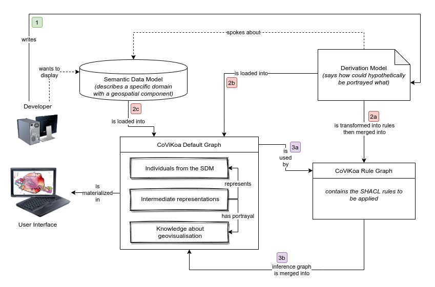

# CoViKoa (i.e. *Comment on Visualise Quoi*)

## Folder content

```
covikoa/
│
├── code/
│   ├── CoViKoa/                          <- Java code for CoViKoa reasoning system
|   |   └── python-wrapper/               <- Code for the Python wrapper and the HTTP server
│   ├── CoViKoa-client/                   <- JS code for CoViKoa client (using OpenLayers)
│   └── ServiceGeosparqlObjetTerritoire/  <- Java code for the "remote" triplestore used in the case studies
│
└── rdf/                                  <- Proposed ontologies (+ reused ontologies)
    ├── case_study_1/                     <- Data & derivation model for case study #1
    ├── case_study_2/                     <- Data & derivation model for case study #2
    ├── case_study_3/                     <- Data & derivation model for case study #3
    └── loac/                             <- Light Choucas Alert Ontology

```

- `code/`:

  - `code/CoViKoa/`: the Java code that allows to load the different vocabularies, that accepts the creation of OAC individuals and that allows to execute CoViKoa rules (one can play with it interactively in a Python interpreter after running the script that is in the `py-wrapper` directory -- this directory also contains the code for the HTTP server).

  - `code/CoViKoa-client/`: the JavaScript code that allows to consume the geovisual representation in the KB.

  - `code/ServiceGeosparqlObjetTerritoire/`: Java code to start a GeoSPARQL endpoint that exposes data from OpenStreetMap on a large spatial extent and using the territory object hierarchy formalized in LOAC. The endpoint supports a "light" OWL inference regime (`Jena OWLMicro reasoner`) which allows us to use the different inverse / transitive / etc. properties used for territory objects in LOAC.

- `rdf/`: the vocabularies used, the rules used, as well as the data needed to run the examples (see [below](#ontologies-used) for details).

----

## Overview

### Why CoViKoa ?

Because we believe that there should be a simple, ergonomic and flexible way to describe how to geovisualize individuals from an existing ontological model (we call it the *Semantic Data Model*).

Given that this proposal targets notably knowledge engineers, and because we aim to extend models in a reusable way rather than produce source code, this description will be done in the form of an ontology extanding the Semantic Data Model : we call this specification the *Derivation Model*.

We will exploit the different classes to which they belong and their hierarchies, as well as the properties that qualify them to specify how to represent these individuals. But that's not all, we will also specify other elements that are essential to the creation of an efficient geovisualization.

In the end, almost everything will happen in our knowledge base, instrumented by SHACL rules (part of them are generic and we provide them, another part is dynamically generated from the derivation model), but we also provide the code (generic in that it adapts to any models succesfully loaded in CoViKoa, and not in particular to our case studies) that makes the necessary queries to this knowledge base to build the concrete geovisualization.

### Ontologies used

- [CoViKoa-geoviz](./rdf/voc-geoviz.ttl) : a generic, extensible, high-level vocabulary describing what a geovisualization user interface can be.
- [CoViKoa-derivation](./rdf/voc-derivation.ttl) : vocabulary necessary to write the Derivation Model - it allows to describe how the individuals to be represented graphically should be prepared.
- *Graphic*, *symbolizer* and *symbols* ontologies that describe all the elements needed for building simple portrayals (from Huang & Harrie, 2019)
- [*Scale*](./rdf/voc-hh-scale.ttl) ontology that allows to describe the scale of validity of a portrayal (from Huang & Harrie, 2019, itself based on Carral et al., 2013)
- [CoViKoa-context](./rdf/voc-context.ttl) : a vocabulary describing the visualisation context of the client organized around the initial expected state of the various geovisualisation components (height and width of the map, library used, display or not of the legend, etc.).

- Reference ontologies used internally by the project are mainly [GeoSPARQL](http://schemas.opengis.net/geosparql/1.0/geosparql_vocab_all.rdf), [SHACL vocabulary](https://www.w3.org/TR/shacl/), [OWL-time](https://www.w3.org/TR/owl-time/) and [Prov-O](https://www.w3.org/TR/prov-o/) (where the last 3 are W3C Recommendations).

### SHACL rules & shapes

We are providing a set a base SHACL functions needed for our system to run (see [here](./rdf/rules-base-functions.ttl)), a set of SHACL rule used to generate the actual SHACL rules that will be used when using CoViKoa (see [here](./rdf/rules-generation-rules.ttl)) and SHACL shapes allowing to validate the Derivation Model (see [here](./rdf/shapes-derivation-model.ttl))


After reading the Derivation Model, SHACL rules adapted to the use case of this specific Derivation Model will be generated. 4 types of rules can be distinguished in our approach :
- Derivation rules
- Default Enrichment rules
- Problem-specific enrichment rules
- Data Integration rules

It is the application of these rules to the graph data that will make it possible to create the necessary IRs and then to make the semantic links with the symbolisers representing them graphically.

### The worklow



Concretly, after writing the derivation model, one have to create a [TOML](https://toml.io/) configuration file like so :

```toml
derivation-model = "rdf/case_study_1/derivation-model-oacs.ttl"
```

This `derivation-model` entry is the only one mandatory (as it can import the targeted Semantic Data Model) but a few others can be used :

- `target-semantic-data-model-files` *(expects an array of strings)*: it can be used to specify the file(s) containing the targeted Semantic Data Model (for example one file with the model and one file with the individuals - *note that it will be redondant if the derivation model already import them*)

- `covikoa-vocabularies` *(expects an array of strings)*: it can be used to specify the vocabularies to be used by CoViKoa - only developers may use it.

- `covikoa-base-rules` *(expects an array of strings)*: it can be used to specify the base rules to be used by CoViKoa - only developers may use it.

The path to use has to be the relative path to the targeted file from the configuration file in question.

🚀 Follow the examples below to test it with the derivation models provided for our case studies !


### Example data

> Note that terms in italic are part of the Choucas Alert Ontology (their meaning can be found in French in Viry & Villanova, 2020, or in english on [http://purl.org/loac](http://purl.org/loac))

In both case studies we want to present the data from the *alert* to a rescuer in an intelligent way:
- before presenting him/her with the *alert* data, we want to add context data from OpenStreetMap
- these data will be used, when presenting the geovisualization to him/her to answer a domain problem that the rescuer may have: what are the *reference objects*, present in the *probable location area* and not falling into *categories* already used in *clues*, which could be used to question the victim and refine *probable location area*? (this problem is encoded in the Derivation Model and the individuals who satisfy it obtain a different graphic representation to highlight them)

*We suggest that a reader who would like to learn how to write a Derivation Model should go through the 3 case studies. On the contrary, a reader who only wishes to see a result can go directly to case study #3.*

**Case study #1**

This case study uses data from a fictitious *alert* containing two location *clues* given by a victim.
An *initial location area* was also defined and *compatible location areas* were calculated within it. This allowed the calculation of a *probable location area* (the area in which the victim is likely to be in relation to the two *clues*).

This example shows how to define transformations of geometries as well as the use of a property to differentiate the symbolisation of individuals that fall under the same concept in the Semantic Data Model used.

**Case study #2**

This case study uses data from an other fictitious *alert* also containing two location *clues* given by a victim.
As before, an *initial location area* was also defined and *compatible location areas* were calculated within it. This allowed the calculation of a *probable location area* (the area in which the victim is likely to be in relation to the two *clues*).

This example shows how to define transformations of geometries as well as the use of chain of properties to differentiate the symbolisation of individuals that fall under the same concept in the Semantic Data Model used.


**Case study #3**

This case study uses the same data than case study #2.  
This example shows how to define more complex cases of geometry transformations notably depending on the visualisation scale.

The use of the `Scale` vocabulary shows one of the strength of our proposal : in order to assist the understanding and the reading of the geovisualisation, representations can be defined a priori, linked to a zoom level and mobilising différent transformations of the original geometries in order to compose an intelligent geovisualisation that responds to our problems.


## How to run the code examples

**Option 1 : Using Docker**

- Clone or download this repository.

- Enter into the CoViKoa root folder:

```
cd covikoa/
```

- Build the Docker image:

```
docker build -t "covikoa:latest" .
```

- Run the image *(using the 3rd case study)*:

```
docker run --publish "8000:8000" -it "covikoa:latest" case-study-3.toml
```

*Performance can be slightly degraded inside the Docker container*

- Go on http://0.0.0.0:8000/ using any modern web-browser to see the example map.


**Option 2 : Using an existing development environment**

- Prerequisite : JRE 11 and Python3.7+

- Clone or download this repository.

- Enter into the CoViKoa root folder:

```
cd covikoa/
```

- Install Python dependences:

```
python3 -m pip install -r code/CoViKoa/py-wrapper/requirements.txt
```

- Run the application on port 8000 :

```
cd code/CoViKoa/ && python3 py-wrapper/server.py ../case-study-1.toml
```

- Go on http://0.0.0.0:8000/ using any modern web-browser to see the example map.


## Licences and attributions

- **Code** : The code we propose is licensed under the terms of [Apache License, version 2.0](https://www.apache.org/licenses/LICENSE-2.0.html) and is written by Matthieu Viry.

- **Vocabularies** : The vocabularies we propose are licensed under the terms of [CC BY-NC-SA 4.0](https://creativecommons.org/licenses/by-nc-sa/4.0/) and are written by Matthieu Viry and Marlène Villanova-Oliver.

- The **data used for the reference objects** is extracted from OpenStreetMap project (available [here in turtle syntax](./rdf/loac/data-loac-reference-objects.ttl)). It belongs to [© OpenStreetMap contributors](https://www.openstreetmap.org/copyright) and it is licensed under the Open Data Commons Open Database License [ODbL](https://opendatacommons.org/licenses/odbl/) by the OpenStreetMap Foundation (OSMF).
