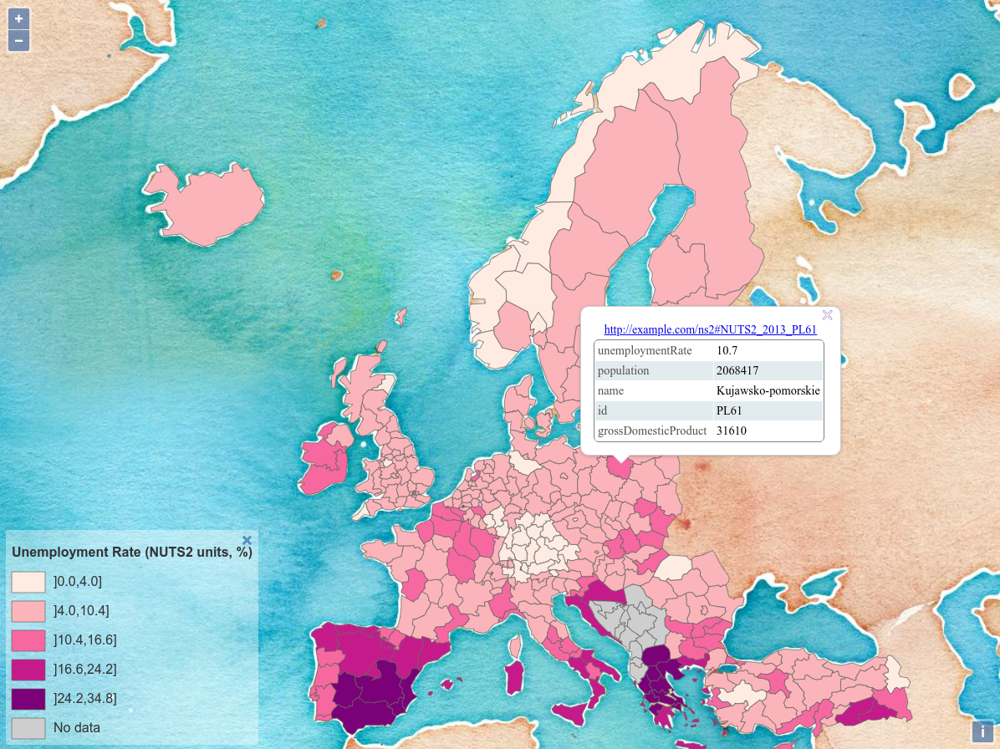

## Case study 4

The data is NUTS2 units (in 2013 version).

The Derivation Model demonstrates how to build a choropleth map with a legend, and an *identify* interaction on the portrayed features.

**_Result:_**

